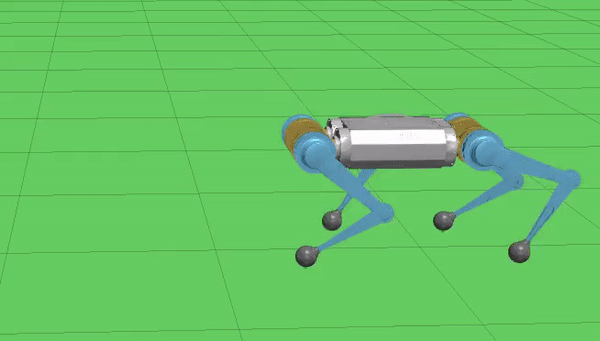
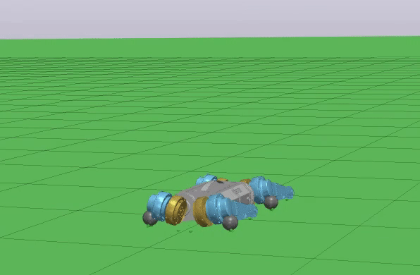
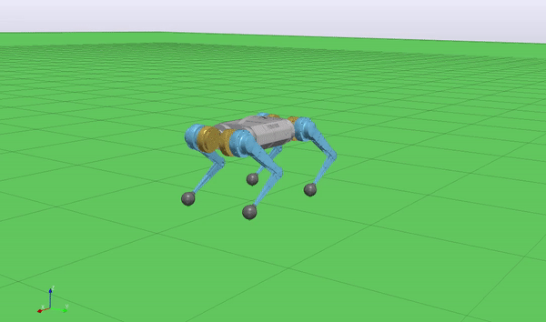
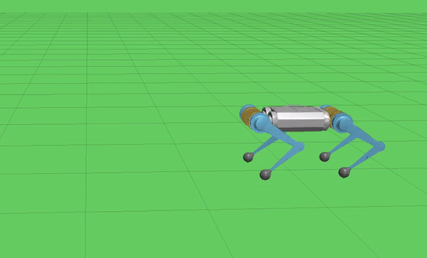
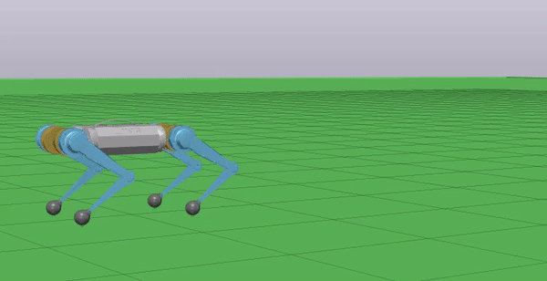
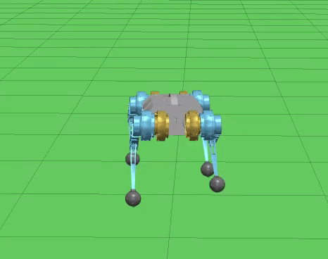

# Quadruped Control 

<p align="center">
  
</p>

# Table of Contents 
- [Control Architecture](#Control-Architecture) </br>
    - [Balance Controller](#Balance-Controller) </br>
    - [Swing Leg Controller](#Swing-Leg-Controller) </br>
- [Planning](#Planning) </br>
    - [Foot Step Planner](#Foot-Step-Planner) </br>
    - [Foot Trajectory](#Foot-Trajectory) </br>
- [Getting Started](#Getting-Started) </br>
  - [Development-Environment](#Development-Environment) </br>
  - [Dependencies](#Dependencies) </br>
  - [Optional Dependencies](#Optional-Dependencies) </br>
  - [Dependency Versions](#Dependency-Versions) </br>
  - [Workspace](#Workspace) </br>
  - [Launch](#Launch) </br>

# Control Architecture
## Balance Controller 
The balance controller architecture is based on ETH Zürich Star1ETH, IIT HyQ, and MIT Mini Cheetah. 

The robot is modeled as a single rigid body with ground reaction forces at the feet using the Newton-Euler equations of motion. PD control is used to compose the desired center of mass linear and angular accelerations based on the center of mass pose and velocities. A quadratic program is minimized to find the ground reaction forces that produce the desired center of mass acclerations. The quadratic program has infinitely many solutions. Therefore, in order for the optimization to converge, it is constrained such that the ground reaction forces must exist within a friction cone. The ground reaction forces are transformed into joint torques using the jacobian transpose. The balance contoller is only used for feet in the stance phase.

Below, the balance controller is used to transition the quadruped from laying to standing.
<p align="center">
  
</p>

The benefit of this controller is that is provides an alternative way of achieving a desired center of mass orientation without requiring full body inverse kinematics. 
<p align="center">
  
</p>

To demonstrate the robustness of the balance controller, the robot stands upright with the knees 
locked out. In this state, the robot is most unstable and therefore difficult to balance.
<p align="center">
  
</p>

## Swing Leg Controller
When a leg is in swing state, a joint level PD controller is used. The reference trajectory consists of desired foot positions and velocities. The desired foot position is transformed to joint positions using an analytical inverse kinematic solution. The desired foot velocity is transformed to joint velocities using the jacobian inverse. If the jacobian is near singular, the Moore-Penrose pseudo-inverse of the jacobian is used. However, sometimes the pseudo-inverse cannot be solved within a tolerance and the jacobian transpose is used as an approximation of the inverse.

# Planning
## Foot Step Planner
The foothold is determined using the Raibert heuristic and the linear inverted pendulum model.

## Foot Trajectory
The foot trajectory consists of desired foot positions and velocities. Given the starting and final foot positions and a desired foot height, the trajectory is composed using a 6th order polynomial. A 6th order polynomial is used because there are 7 trajectory constraints, therefore there exists unique polynomial coefficients. The constraints are: 3 position constraints for start, final, and center (max height is achieved here) foot positions, 2 velocity constraints (starting and final foot velocities are 0), and 2 acceleration constraints (starting and final foot accelerations are 0).

# Results 

The fastest forward walking speed achieved so far was 0.4 m/s.
Below are gait transitions from a stationary state to walking forwards and backwards at 0.2 m/s.
<p align="center">
  
  
</p>

The quadruped can walk sideways (max speed 0.1 m/s) and rotate about the z-axis. The max yaw rate is 0.05 rad/s. Further work is needed to improve this capability.

<p align="center">
  
  
</p>

# Getting Started
## Development Environment 
- Ubuntu 20.04 
- ROS Noetic 
- GCC 9.3.0

## Dependencies
- [Armadillo](http://arma.sourceforge.net/)
- [Drake](https://github.com/RobotLocomotion/drake)
- [qpOASES](https://github.com/coin-or/qpOASES)

**Important**: The current version of qpOASES only creates a static library and will 
cause Armadillo to segfault. The segfault is likely due to the fact that qpOASES redefines internally some BLAS/LAPACK functions and this can create problems if linking with another library that uses BLAS or LAPACK. For more info see [PR #108](https://github.com/coin-or/qpOASES/pull/108) and [PR #109](https://github.com/coin-or/qpOASES/pull/109).

To properly build qpOASES, add/modify the following lines to the CMakeLists.txt.

```cmake
# Avoids names conflicting with BLAS/LAPACK
SET(CMAKE_CXX_FLAGS "${CMAKE_CXX_FLAGS} -D__AVOID_LA_NAMING_CONFLICTS__")

# Remove STATIC to build a shared library
ADD_LIBRARY(qpOASES ${SRC})
```

## Optional Dependencies 
For improved performance in both Armadillo and qpOASES, install first [OpenBlas](https://github.com/xianyi/OpenBLAS) and [LAPACK](https://github.com/Reference-LAPACK/lapack). See Armadillo's install [notes](http://arma.sourceforge.net/download.html).

## Dependency Versions 
- OpenBlas 0.3.13 
- LAPACK 3.9.0
- Armadillo 10.2.1
- Drake v0.26.0
- qpOASES master (SHAID: 326a651)

## Workspace 
If you don't have vcstool, see the [install instuctions](https://github.com/dirk-thomas/vcstool#how-to-install-vcstool).
Create a workspace and build:
```
mkdir -p quadruped_ws/src 
cd ~/quadruped_ws/src 
wget https://raw.githubusercontent.com/bostoncleek/quadruped_control/master/quadruped.repos
vcs import < quadruped.repos
cd ~/quadruped_ws
catkin config --extend /opt/ros/${ROS_DISTRO} --cmake-args -DCMAKE_BUILD_TYPE=Release
catkin build
```

## Launch 
The Drake install instructions recommend extracting the binaries to `/opt`. Add the Drake binaries to your `PATH` to make runnning the visualization tools easier. 
```
export PATH="/opt/drake/bin/:$PATH"  
```

Then run the Drake visualizer: 
```
drake-visualizer
```

Launch the Drake-ROS Interface. The robot model should appear laying down in an empty world. 
```
roslaunch quadruped_simulation world.launch
```

Finally, launch the controller:
```
roslaunch quadruped_controller control.launch
```

Tell the robot to transition into the standing configuration:
```
rosservice call /stand_up
```

If the robot falls over, reset it to the initial configuration 
```
rosservice call /start_position
```

Use a gamepad to drive the robot. The left joystick controls the translation in the xy plane 
and the right joystick will control the yaw rate. 

There is a gait visualization tool. To launch this tool run:
```
roslaunch quadruped_controller gait_visualizer.launch
```

<p align="center">
  
</p>
